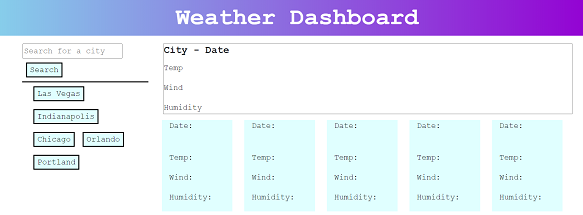
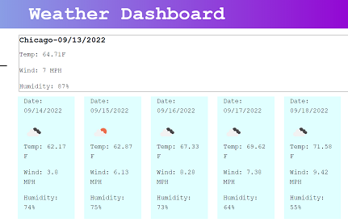

# weather-dashboard

## Description
This application uses Bootstrap, Jquery, and Moment.js to display weather information for cities input by a user. A user can search for a city using the search box and receive current weather information and a 5-day forecast. After the search is executed the city name is then entered into search history and a button is created so the user can return to that city as desired.

## Link to Live Page
[Live Link]()

## Screenshots

